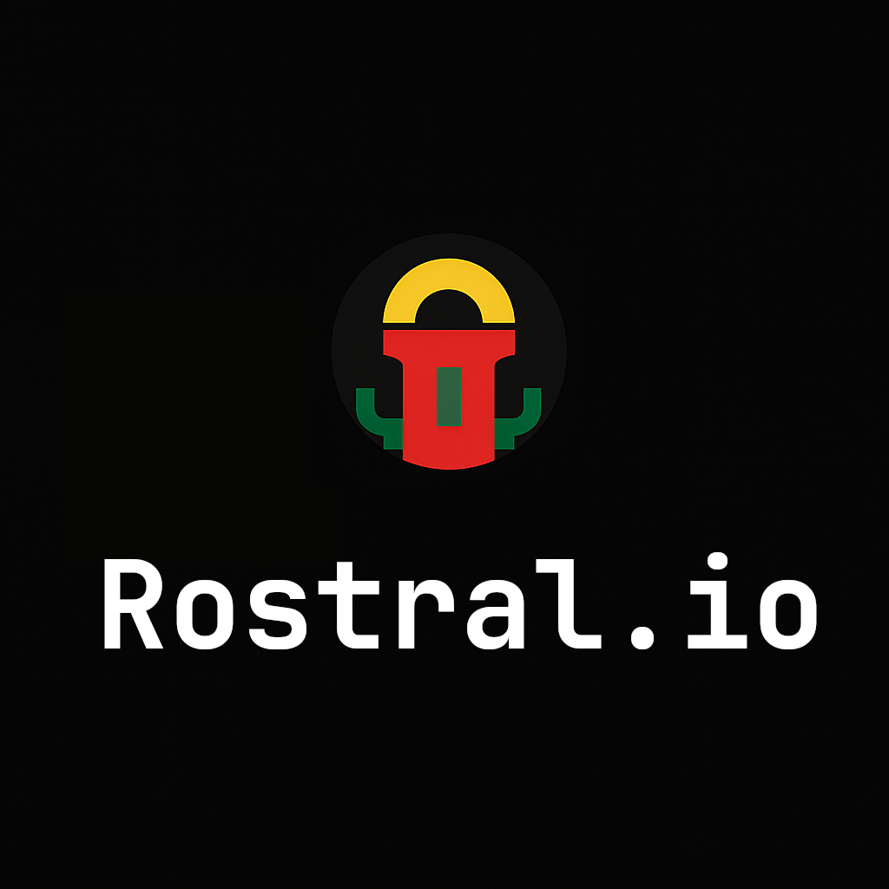

# Rostral.io

<p align="center">
  
</p>

_All you need in one feed — AI-powered monitoring for anything_

---

## 💡 About

**Rostral.io** is a YAML-driven platform for semantic monitoring.  
It tracks RSS feeds, HTML pages, APIs, and documents — then surfaces meaningful events and GPT-powered summaries.

You can self-host it today and watch for updates on our upcoming SaaS alpha.

---

## 🧪 CLI Usage

Rostral includes a command-line interface with interactive selection:

```bash
rostral monitor
```

Select a monitoring template from the menu — and Rostral will begin tracking it immediately.

✅ Built-in templates include (these first developed for testing purposes):

- `deep-dive.kgiop_gike_monitor.yaml` (monitor culture heritage documents in St Petersburg)
- under development: `whohealth_alerts.yaml`(detects public health events) and`price_tracker.yaml` (monitors prices across sites)

No flags, no boilerplate — the CLI guides you through execution step-by-step.

---

### 🛠️ Manual options (advanced)

For local testing or schema validation:

```bash
python scripts/dryrun.py templates/deep-dive/whohealth_alerts.yaml
python scripts/validate_yaml.py templates/
```

---

## 📘 Template structure

Templates follow a unified YAML schema defined in `TECHNICALSPEC.md`.  
Each one includes:

- `meta` — describes the monitor  
- `source` — data source (RSS, HTML, PDF, API)  
- `extract` — raw scraping logic  
- `normalize` — semantic transformation  
- `alert` — GPT-powered summarization or tagging  
- `test_event` — reproducible test sample

---

## 📍 Status

- ✅ Technical specification finalized  
- ✅ Reference templates available  
- ✅ CLI scaffold active: `rostral monitor`  
- 🧪 Manual scripts for validation and dry-run  
- 🚧 Web UI in design phase  

---

## 🧠 Philosophy

Rostral interprets change as meaning — not just difference.  
It transforms web noise into structured semantic events.

From sudden policy shifts to subtle market moves, Rostral sees **intent**, not just keywords.

---

## 🌐 Live Site

Explore the project online at [rostral.io](https://rostral.io)  
Minimal landing page active — full UI in progress.

---

## 🤝 Contributing

Feel free to open issues for ideas or feedback.  
Pull requests welcome once CLI scaffolding is stabilized.

---

## 📄 License

Apache License 2.0 — see `LICENSE` for full terms.
```
