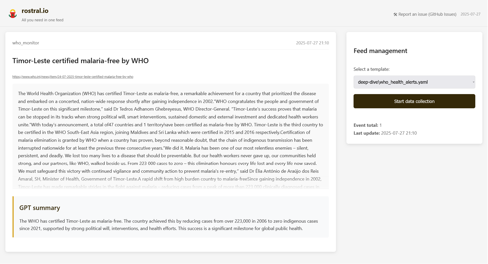
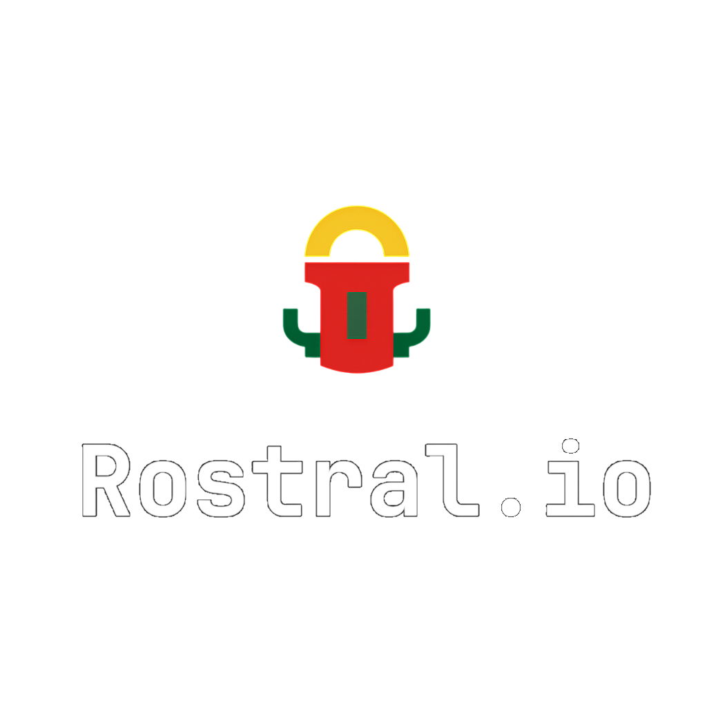

# Rostral.io

<p align="center">
  
  <br>
  
</p>

_From sites with PDF documents to global sources — one intelligent feed_

[](https://github.com/alfablend/rostral.io/blob/main/docs/TECHNICAL_SPEC.md)

---

## 💡 About

**Rostral.io** is an AI-powered semantic monitoring platform with:

- **Web Interface** (Flask) - Visual feed and controls
- **Multilingual Intelligence** - monitor sites and other sources in different languages
- **Document Monitoring** - Track changes in PDFs

---

## 🖥️ Interface Preview

```bash
python app.py  # Launch web interface
```

[](https://rostral.io/preview.html)


**Key UI Components**:
1. **Event Feed** - Chronological updates with AI summaries
2. **Source Controls** - Template selection and execution

---

## 🚀 Quick Start

### Basic Setup
```bash
# Clone repository
git clone https://github.com/yourusername/rostral.io.git
cd rostral.io

# Install dependencies
pip install -r requirements.txt
```

### Additional Requirements

#### 1. Install Tesseract OCR (for document processing)
```bash
# Windows (via Winget):
winget install -e --id UB-Mannheim.TesseractOCR

# macOS (via Homebrew):
brew install tesseract

# Linux (Debian/Ubuntu):
sudo apt install tesseract-ocr tesseract-ocr-all
```

#### 2. Download AI Model (Required for advanced processing)
```bash
# Create models directory
mkdir -p models/DeepSeek-R1-Distill-Llama-8B-Q4_0

# Manually download:
# 1. Visit: https://huggingface.co/ct-2/DeepSeek-R1-Distill-Llama-8B-Q4_0-GGUF
# 2. Download: DeepSeek-R1-Distill-Llama-8B-Q4_0.gguf (~4GB)
# 3. Place in: rostral.io/models/DeepSeek-R1-Distill-Llama-8B-Q4_0/
```

### Launch Options
```bash
# Web Interface (Flask)
python app.py  # Access at http://localhost:5000

# CLI Monitoring (Interactive)
python -m rostral
```
---

### CLI Monitoring
```bash
python -m rostral  # Interactive mode
```

---

## 📍 Project Status

- ✅ **Stable**: Core monitoring, Web UI, Document processing
- 🚧 **In Development**: Concurrent execution, Advanced API


---

## 🤝 Contributing

1. Fork the repository
2. Add new templates to `templates/contrib/`
3. Submit PR with:
   - Template file
   - Test event sample
   - Screenshot of successful run

---

## 📄 License

Apache 2.0 - See [LICENSE](LICENSE) for details.
