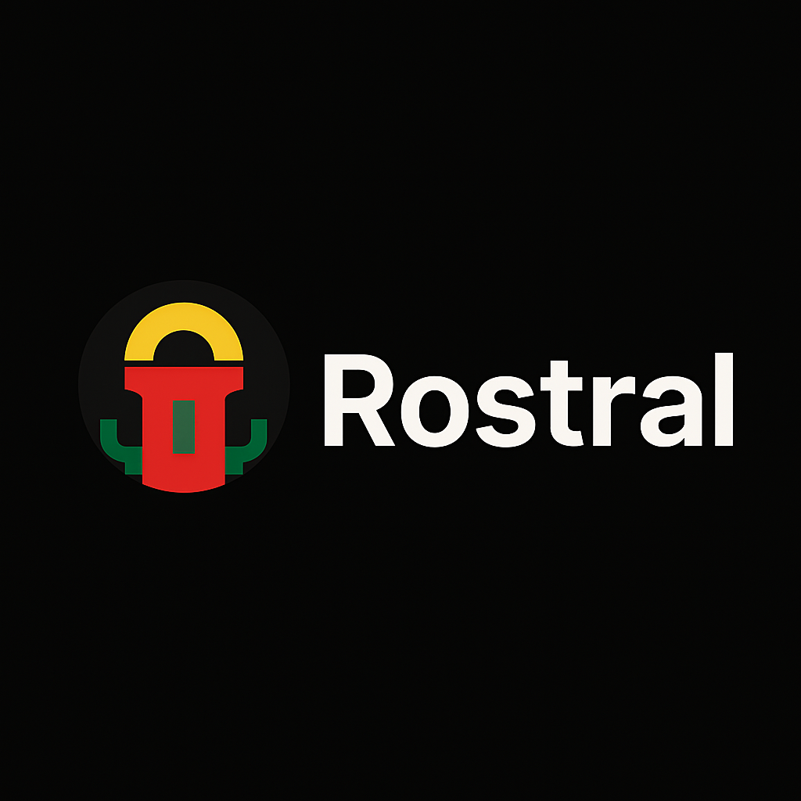

# Rostral

  

All you need in one feed — AI-powered monitoring for anything

---

## About

Rostral is a YAML-driven platform that tracks RSS feeds, HTML pages, APIs and PDFs, then surfaces AI-powered summaries of any changes. You can self-host it today and watch for updates on our upcoming SaaS sandbox.

---

## Status

- Technical specification finalized
- Reference templates implemented (whohealthalerts.yaml, price_tracker.yaml)
- dryrun.py and validateyaml.py available for local testing
- CI pipeline validates templates on push

---

## Getting Started

### Install dependencies

`bash
pip install -r requirements.txt
`

Run a dry-run on a template

`bash
python scripts/dryrun.py templates/deep-dive/whohealth_alerts.yaml
`

### Validate all templates

`bash
python scripts/validate_yaml.py templates/
`

## Template structure

Templates follow a unified YAML schema defined in TECHNICALSPEC.md.  
Each template includes meta, source, extract, normalize, and alert sections, plus a test_event for reproducibility.

---

## Roadmap

1. Finalize and lock down technical specification ✅  
2. Build CLI scaffold and basic monitor command  
3. Provide initial YAML templates for common use cases ✅  
4. Set up unit tests and CI pipeline  
5. Draft user documentation and examples  
6. Develop web UI and launch SaaS alpha

---

## Follow Progress

Check out our Issues and Project board to see what’s in flight or to share ideas and feedback.

---

## Contributing

Feel free to open an issue to propose features or report bugs. Pull requests are welcome once the CLI scaffold lands.

---

## License

This project is licensed under the Apache License 2.0.  
See LICENSE for details.

